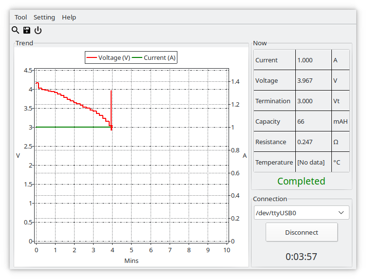

# shunda_tec06
This provides text (to stdout) and GUI data collection from a Shunda Tec-06 battery tester, as described at https://www.sevarg.net/2018/01/14/tec-06-serial-battery-tester-review/ and https://www.sevarg.net/2018/01/20/reverse-engineering-tec-06-serial/

Note that it relies on a non-standard high-speed serial interface, so far the only device that I've found that supports this is a genuine (not a counterfeit) FTDI FT232.

If the program is built as a console program (e.g. using the included makefile) or the GUI variant is invoked with a port on the commandline (e.g. /dev/ttyUSB0) then it provides text output which can be redirected to a file. If it is run as a GUI application (no commandline parameter) then it provides graphical output but has no provision to save either a graph or captured text to a file.

Unfortunately my unit has just died, which limits the likelihood of further work in the short or medium term.
